# UniEmpleo — Plataforma Web de Empleo Universitario y Primer Empleo

> **UniEmpleo** conecta a estudiantes universitarios y recién graduados con empresas comprometidas a brindar oportunidades de prácticas profesionales, pasantías y primeras experiencias laborales en Colombia y Latinoamérica.

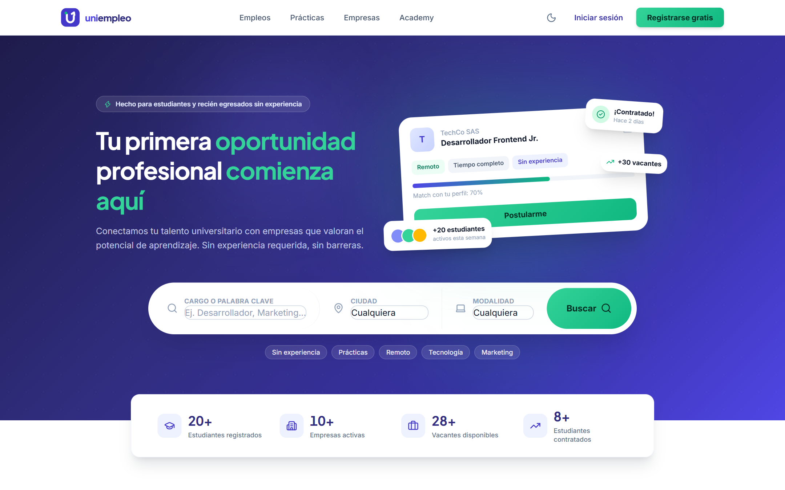

## 📚 Documentación

| Documento | Contenido |
|---|---|
| [**Guía del código**](docs/GUIA-DEL-CODIGO.md) | Cómo está construido el backend y el frontend: capas, conexión a PostgreSQL, autenticación, transacciones, alertas y pruebas, con fragmentos del código explicados |
| [**Base de datos (PostgreSQL)**](docs/BASE-DE-DATOS.md) | Modelo de datos, diagramas entidad-relación, decisiones de diseño, la migración desde SQLite y 10 consultas con su resultado real |

---

## 🚀 Arquitectura Tecnológica

La plataforma está diseñada con una arquitectura desacoplada full-stack:

### Frontend
- **Framework**: React 19 + Vite 8
- **Estilos**: TailwindCSS v4 + CSS personalizado + Google Fonts (Outfit & Inter)
- **Enrutamiento**: React Router DOM v7 con control de acceso por roles (`student`, `company`, `admin`)
- **Visualización de Datos**: Recharts (Gráficos de barras, pastel, áreas de postulaciones y analítica de mercado)
- **Iconografía**: Lucide React + SVGs optimizados
- **Notificaciones**: React Hot Toast

### Backend
- **Entorno**: Node.js + Express 4, organizado en rutas → controladores → servicios → modelos
- **Base de Datos**: **PostgreSQL** con el driver `pg` y un pool de conexiones; consultas parametrizadas, transacciones y restricciones `CHECK` / `UNIQUE` en la base
- **Seguridad**: Autenticación mediante JWT (JSON Web Tokens) y cifrado de contraseñas con `bcryptjs`
- **Pruebas**: prueba de punta a punta de toda la API con `node:test` (`npm test`)
- **CORS & Proxy**: Configuración completa con proxy inverso en Vite (`/api` → `http://localhost:5000`)

---

## 🖼️ Capturas

| | |
|---|---|
| 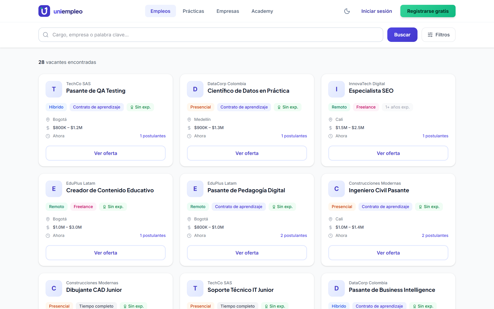 | 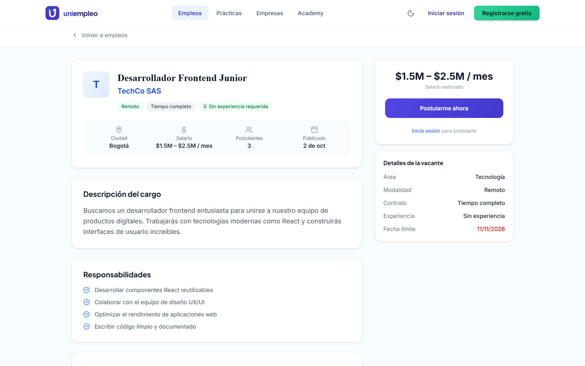 |
| **Buscador de empleos** con filtros | **Detalle de la vacante** y postulación |
| 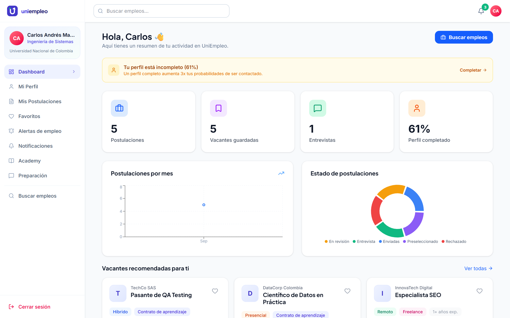 | 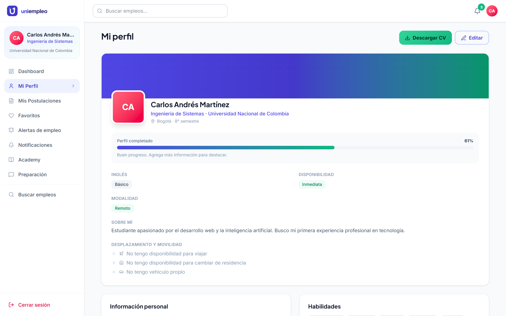 |
| **Panel del estudiante**: postulaciones por mes y por estado | **Perfil profesional** con su porcentaje de completitud |
| 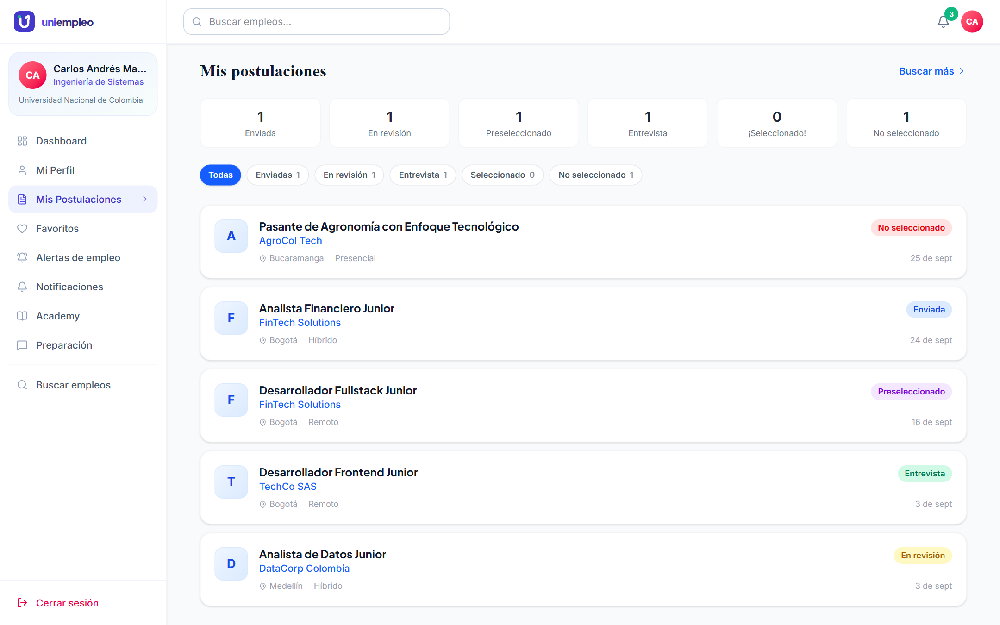 | 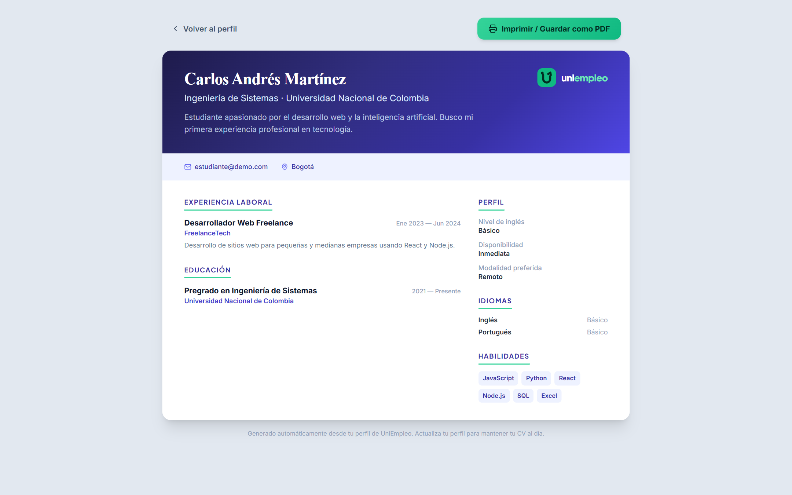 |
| **Seguimiento de postulaciones** | **Hoja de vida** generada desde el perfil |
| 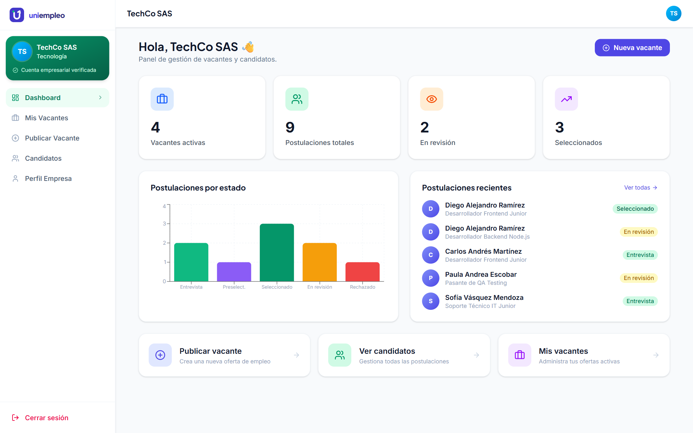 | 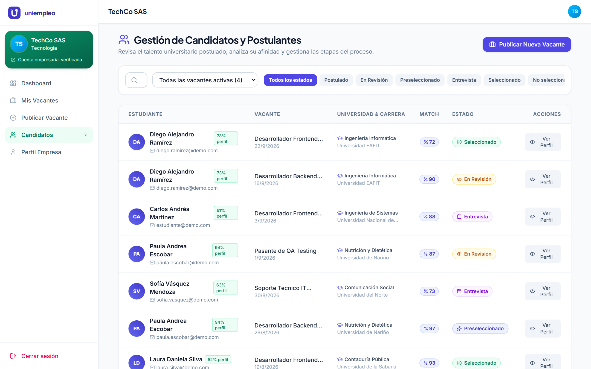 |
| **Panel de la empresa** | **Gestión de candidatos** y etapas del proceso |
| 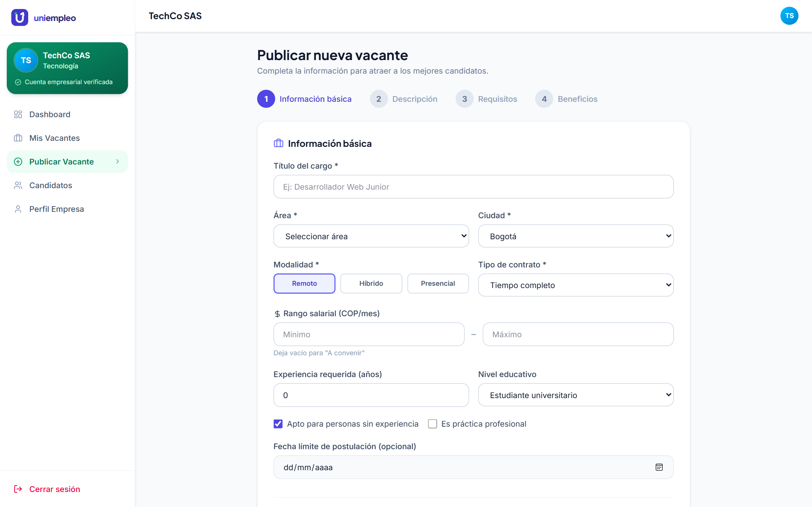 | 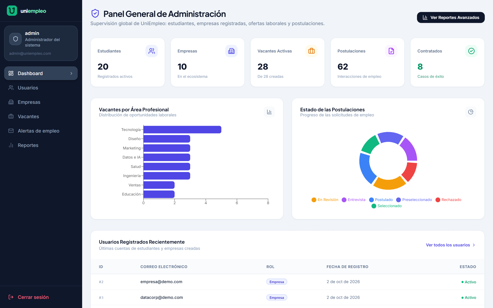 |
| **Publicación de vacantes** en 4 pasos | **Panel de administración** |
| 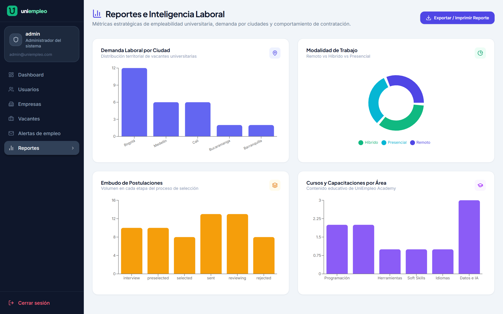 | 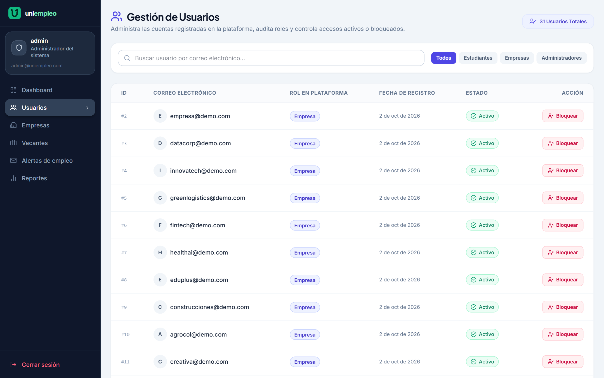 |
| **Reportes** de demanda laboral | **Gestión de usuarios** |
| 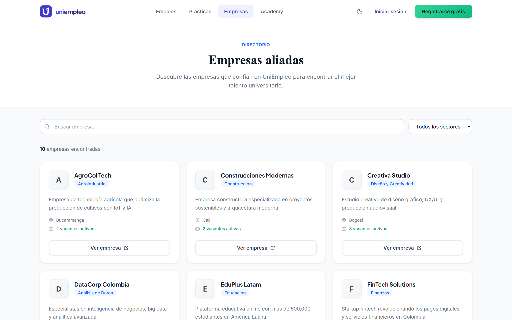 | 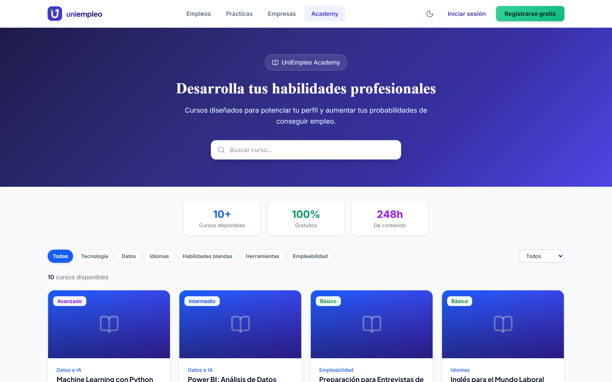 |
| **Directorio de empresas** | **UniEmpleo Academy** |

---

## 🗄️ Base de Datos

PostgreSQL con 21 tablas, claves foráneas con borrado en cascada, restricciones que rechazan datos imposibles (por ejemplo, un salario mínimo mayor que el máximo) e índices pensados para las consultas reales de la aplicación. Detalle completo en [docs/BASE-DE-DATOS.md](docs/BASE-DE-DATOS.md).

| | |
|---|---|
|  |  |
| **Modelo entidad-relación** de vacantes y postulaciones | **Vacantes afines** a las habilidades de un estudiante (intersección de arreglos) |
|  |  |
| **Habilidades**: lo que piden las empresas frente a lo que tienen los estudiantes | PostgreSQL **rechaza** un rango salarial invertido |

---

## 👥 Cuentas de Demostración (Seed Data)

La base de datos viene precargada con datos realistas para probar todos los flujos de la plataforma:

| Rol | Correo Electrónico | Contraseña | Descripción |
|---|---|---|---|
| **Estudiante** | `estudiante@demo.com` | `demo1234` | Estudiante de Ing. de Sistemas (Carlos Martínez) con postulaciones, favoritos y CV |
| **Estudiante 2** | `ana.garcia@demo.com` | `demo1234` | Estudiante de Administración de Empresas |
| **Empresa** | `empresa@demo.com` | `demo1234` | Empresa TechCo SAS con vacantes publicadas y postulantes para revisar |
| **Empresa 2** | `datacorp@demo.com` | `demo1234` | DataCorp Colombia (Sector Analítica) |
| **Administrador** | `admin@uniempleo.com` | `admin1234` | Panel general de control, validación de empresas, usuarios y reportes |

---

## 🛠️ Puesta en Marcha

### Requisitos
- Node.js 20+
- PostgreSQL 14+ (local o con Docker)

### 1. Base de datos

Con Docker (incluido en el repositorio):

```bash
docker compose up -d
```

O con un PostgreSQL instalado, creando el usuario y la base:

```sql
CREATE ROLE uniempleo LOGIN PASSWORD 'uniempleo';
CREATE DATABASE uniempleo OWNER uniempleo;
```

### 2. Backend

```bash
cd backend
cp .env.example .env      # revisa DATABASE_URL y cambia JWT_SECRET
npm install
npm run dev               # crea las tablas y carga la demo la primera vez
```

> El servidor iniciará en `http://localhost:5000`. Las tablas se crean solas al arrancar (`schema.sql`) y, si la base está vacía, se cargan los datos de demostración.

Scripts útiles del backend:

| Script | Qué hace |
|---|---|
| `npm run seed` | Crea las tablas si faltan y carga los datos de demostración |
| `npm test` | Prueba de punta a punta de toda la API (con el backend en marcha) |

### 3. Frontend

```bash
cd frontend
npm install
npm run dev
```

> La aplicación web estará disponible en `http://localhost:5173`.

### Inicio automatizado

Con la base de datos ya levantada, puedes iniciar backend y frontend a la vez y abrir el navegador:

- **Doble clic en Windows**: `iniciar-uniempleo.bat`
- **Desde la terminal raíz**: `npm start`
- **Con PowerShell**: `./iniciar.ps1`

---

## 🌟 Funcionalidades Principales

### 1. Portal Público y Búsqueda
- **Home interactivo**: Estadísticas en tiempo real, buscador inteligente por cargo/carrera/ciudad, categorías destacadas, testimonios y vacantes recientes.
- **Directorio de Empleos (`/empleos`)**: Filtros avanzados por modalidad (remoto, híbrido, presencial), rango salarial, tipo de contrato y sin experiencia requerida.
- **Detalle de Vacante (`/empleos/:id`)**: Descripción, responsabilidades, requisitos, beneficios y modal de postulación con carta de presentación.
- **Directorio de Prácticas (`/practicas`)**: Sección especializada exclusivamente en prácticas universitarias y pasantías.
- **Directorio de Empresas (`/empresas` y `/empresas/:id`)**: Perfiles corporativos con sellos de verificación, cultura de la empresa y ofertas activas.
- **UniEmpleo Academy (`/cursos` y `/cursos/:id`)**: Cursos y módulos formativos para preparación laboral con control de inscripción y avance.

### 2. Panel de Estudiantes (`/dashboard`)
- **KPIs de Empleabilidad**: Postulaciones activas, guardadas, entrevistas agendadas y porcentaje de perfil completado.
- **Línea de Tiempo de Postulaciones (`/postulaciones`)**: Seguimiento en tiempo real de cada etapa (`Postulado` ➔ `En Revisión` ➔ `Preseleccionado` ➔ `Entrevista` ➔ `Seleccionado`).
- **Mi Perfil Profesional (`/perfil`)**: Edición de carrera, universidad, semestre, GPA, habilidades interactivas y enlaces a portafolios/CV.
- **Favoritos (`/favoritos`)**: Guardado rápido de vacantes para aplicar posteriormente.
- **Centro de Notificaciones (`/notificaciones`)**: Avisos automáticos cuando una empresa cambia el estado de tu postulación.
- **Preparador de Entrevistas (`/preparacion`)**: Guía interactiva con preguntas frecuentes de recursos humanos, método STAR y consejos de negociación salarial.

### 3. Panel de Empresas (`/empresa/dashboard`)
- **Métricas de Reclutamiento**: Vacantes activas, total de postulaciones recibidas, entrevistas programadas y candidatos evaluados.
- **Gestor de Vacantes (`/empresa/vacantes`)**: Publicación, edición, pausa y eliminación de ofertas laborales.
- **Publicador Multietapa (`/empresa/vacantes/nueva`)**: Asistente en 4 pasos para definir datos básicos, responsabilidades, competencias requeridas y beneficios ofrecidos.
- **Gestión de Candidatos (`/empresa/candidatos`)**:
  - Filtro por vacante específica y estado de postulación.
  - Cálculo de porcentaje de afinidad / match con la oferta.
  - Visualización del perfil del estudiante, universidad, semestre y carta de presentación.
  - Actualización del estado del proceso con envío automático de notificación al estudiante.
- **Perfil Corporativo (`/empresa/perfil`)**: Personalización de datos de la empresa, redes sociales, visión y misión hacia practicantes.

### 4. Panel de Administración (`/admin`)
- **Dashboard Global**: Estadísticas consolidadas del ecosistema, gráficos de barras de vacantes por área y gráficos circulares de estado de postulaciones.
- **Auditoría de Usuarios (`/admin/usuarios`)**: Directorio con filtrado por rol y botones para activar o suspender cuentas de usuario.
- **Validación de Empresas (`/admin/empresas`)**: Revisión y aprobación de empresas para asegurar que sean ofertas laborales legítimas.
- **Moderación de Vacantes (`/admin/vacantes`)**: Control de calidad de las publicaciones con capacidad de pausar o cerrar ofertas que no cumplan las políticas.
- **Inteligencia y Reportes (`/admin/reportes`)**: Análisis de demanda laboral por ciudades, tendencias de modalidades de trabajo, embudo de conversión y exportación en formato imprimible.

---

## 📄 Licencia
Este proyecto es de código abierto bajo la licencia MIT.
