# Base de datos (PostgreSQL)

UniEmpleo guarda todo en **PostgreSQL**. El esquema está en [`backend/src/database/schema.sql`](../backend/src/database/schema.sql) y se aplica solo al arrancar el backend (es idempotente: `CREATE TABLE IF NOT EXISTS`). El proyecto empezó con SQLite y se migró a PostgreSQL; la sección [Migración desde SQLite](#migración-desde-sqlite) explica qué cambió.

Las imágenes de este documento se generaron ejecutando las consultas **sobre la base real de la demo** (`npm run seed`): los resultados no están escritos a mano. Los diagramas se construyeron leyendo las claves foráneas del esquema.

## Contenido

- [Modelo de datos](#modelo-de-datos)
- [Diagramas entidad-relación](#diagramas-entidad-relación)
- [Decisiones de diseño](#decisiones-de-diseño)
- [Migración desde SQLite](#migración-desde-sqlite)
- [Consultas de ejemplo](#consultas-de-ejemplo)
- [Cómo reproducir las consultas](#cómo-reproducir-las-consultas)

## Modelo de datos

21 tablas en tres áreas:

| Área | Tablas |
|---|---|
| Cuentas y perfiles | `users` (correo, contraseña cifrada, rol), `students`, `companies`, `admin_users`, y el perfil del estudiante: `skills`, `student_skills`, `student_languages`, `educations`, `experiences`, `projects` |
| Empleo | `jobs` (vacantes), `applications` (postulaciones), `interviews`, `saved_jobs`, `job_alerts`, `email_log`, `notifications` |
| Academy | `courses`, `course_modules`, `enrollments`, `favorites` |

## Diagramas entidad-relación

El código Mermaid de cada diagrama está en [`docs/database/`](database/) (archivos `.mmd`).

### Usuarios, estudiantes y empresas
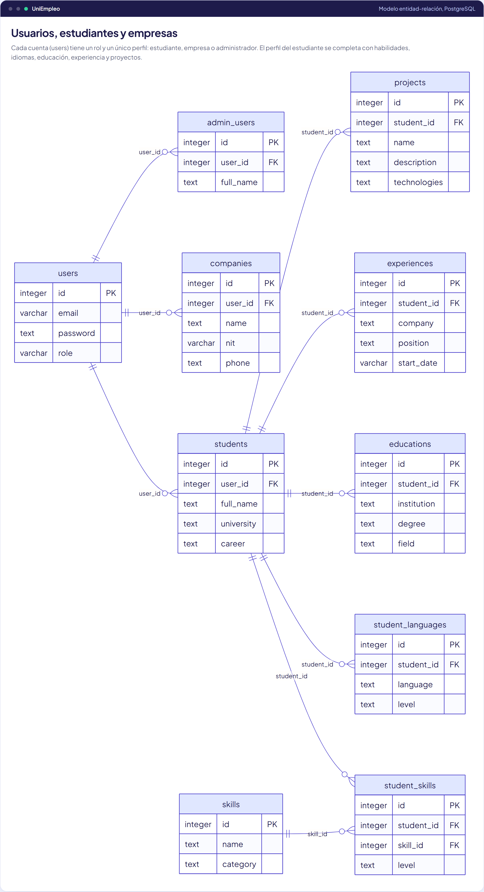

### Vacantes, postulaciones y alertas
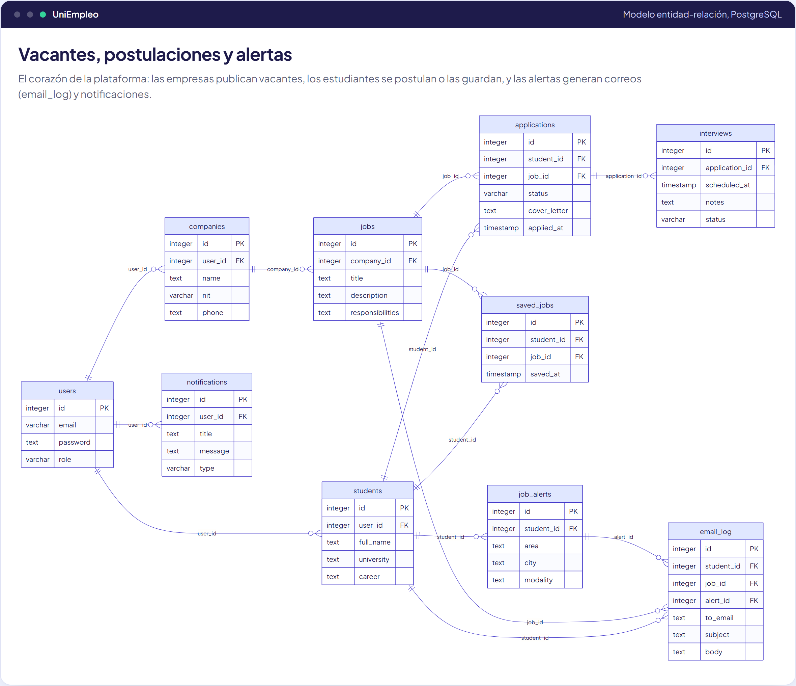

### UniEmpleo Academy y favoritos
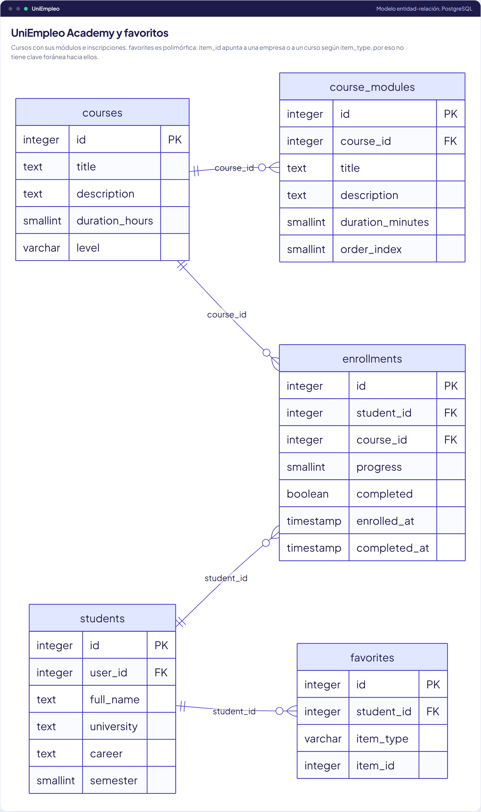

## Decisiones de diseño

| Decisión | Por qué |
|---|---|
| **Una cuenta, un perfil**: `users` + `students` / `companies` / `admin_users` con `user_id UNIQUE` | El inicio de sesión es igual para todos los roles; los datos de cada rol viven en su tabla. `ON DELETE CASCADE` borra el perfil con la cuenta. |
| **`CHECK` con los valores permitidos** (rol, modalidad, estado de la vacante y de la postulación, tipo de notificación, nivel del curso) | Un estado mal escrito no puede entrar aunque el código tuviera un error. |
| **`CHECK` de reglas de negocio**: salario mínimo ≤ máximo, año de fin ≥ año de inicio, progreso y completitud entre 0 y 100, nota del curso entre 0 y 5 | Los datos imposibles se rechazan en la base, no solo en el formulario. |
| **`UNIQUE (student_id, job_id)`** en postulaciones y guardados | Nadie puede postularse dos veces a la misma vacante, ni siquiera con dos clics simultáneos. Los guardados usan `ON CONFLICT DO NOTHING`: guardar dos veces no es un error. |
| **Tipos reales**: `BOOLEAN`, `TIMESTAMP(0)`, `DATE`, `NUMERIC(2,1)` | En SQLite todo era texto o entero. Ahora una fecha de nacimiento inválida o un "talvez" en un campo booleano no se pueden guardar. |
| **Experiencia con fechas `VARCHAR(10)`** | El formulario trabaja con meses (`2025-02`), no con días; guardar un día inventado sería falso. |
| **Índice compuesto `(status, created_at DESC)`** en `jobs` | El listado público siempre pide vacantes activas, las más recientes primero: el índice las entrega ya ordenadas. |
| **`favorites` polimórfica** (`item_type` + `item_id`) | Un mismo listado de favoritos para empresas y cursos. Al no poder tener clave foránea hacia dos tablas, la integridad la controla la aplicación. |
| **Fechas en UTC** | El pool abre cada conexión con `TimeZone=UTC` y el frontend convierte a la hora local del navegador (`frontend/src/utils/date.js`). |

## Migración desde SQLite

| SQLite (antes) | PostgreSQL (ahora) |
|---|---|
| `better-sqlite3`, llamadas síncronas | `pg` con un pool de conexiones; todo el acceso a datos es `async/await` |
| `INTEGER PRIMARY KEY AUTOINCREMENT` | `INTEGER GENERATED ALWAYS AS IDENTITY` |
| `result.lastInsertRowid` | `INSERT ... RETURNING id` |
| `INSERT OR IGNORE` | `INSERT ... ON CONFLICT DO NOTHING` |
| `datetime('now')`, `strftime('%Y-%m', ...)` | `LOCALTIMESTAMP(0)`, `to_char(..., 'YYYY-MM')` |
| `LIKE` (sin distinguir mayúsculas en SQLite) | `ILIKE` |
| Flags `INTEGER` 0/1 | `BOOLEAN` (la API sigue devolviendo 1/0 para no romper el frontend) |
| Archivo `backend/data/uniempleo.db` | Servidor PostgreSQL configurado con `DATABASE_URL` |

Durante la migración se corrigieron errores que ya existían: el registro de estudiantes fallaba (insertaba en una columna `about` que no existe), los paneles del estudiante y de la empresa mostraban siempre cero (el backend devolvía campos con otros nombres), el modelo de cursos usaba una tabla inexistente y la gráfica de modalidades de los reportes repetía "Presencial".

## Consultas de ejemplo

Los archivos SQL están en [`docs/database/queries/`](database/queries/) y se pueden ejecutar tal cual.

### 1. Embudo de postulaciones
[`01-embudo-de-postulaciones.sql`](database/queries/01-embudo-de-postulaciones.sql): porcentaje de cada etapa con una ventana sobre el agregado.

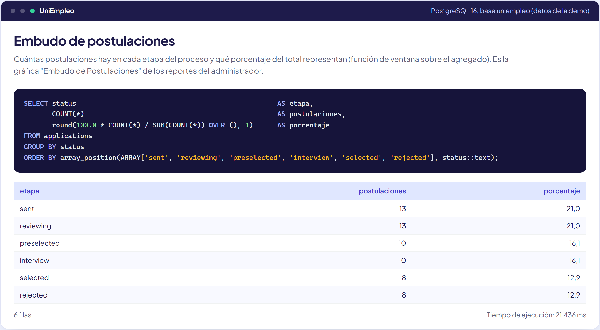

### 2. Vacantes por área
[`02-vacantes-por-area.sql`](database/queries/02-vacantes-por-area.sql): `FILTER` para separar activas y prácticas.

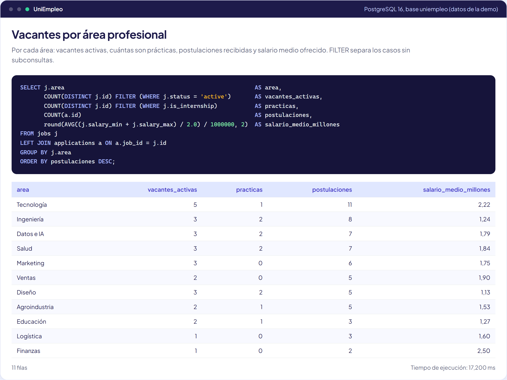

### 3. Empresas y tasa de selección
[`03-empresas-y-seleccion.sql`](database/queries/03-empresas-y-seleccion.sql): `NULLIF` para no dividir entre cero.

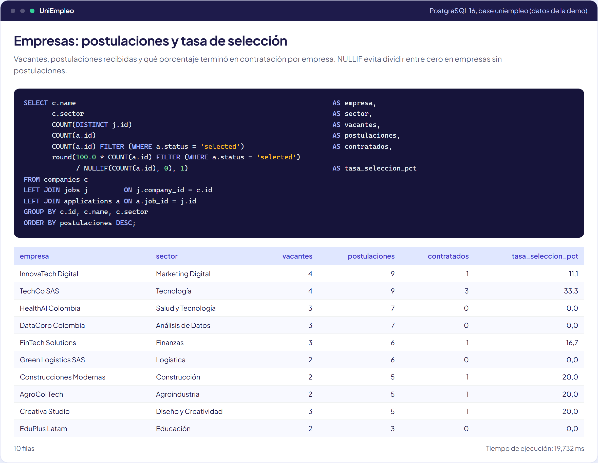

### 4. Oferta y demanda de habilidades
[`04-oferta-y-demanda-de-habilidades.sql`](database/queries/04-oferta-y-demanda-de-habilidades.sql): `string_to_array` + `unnest` convierten el texto de habilidades en filas.

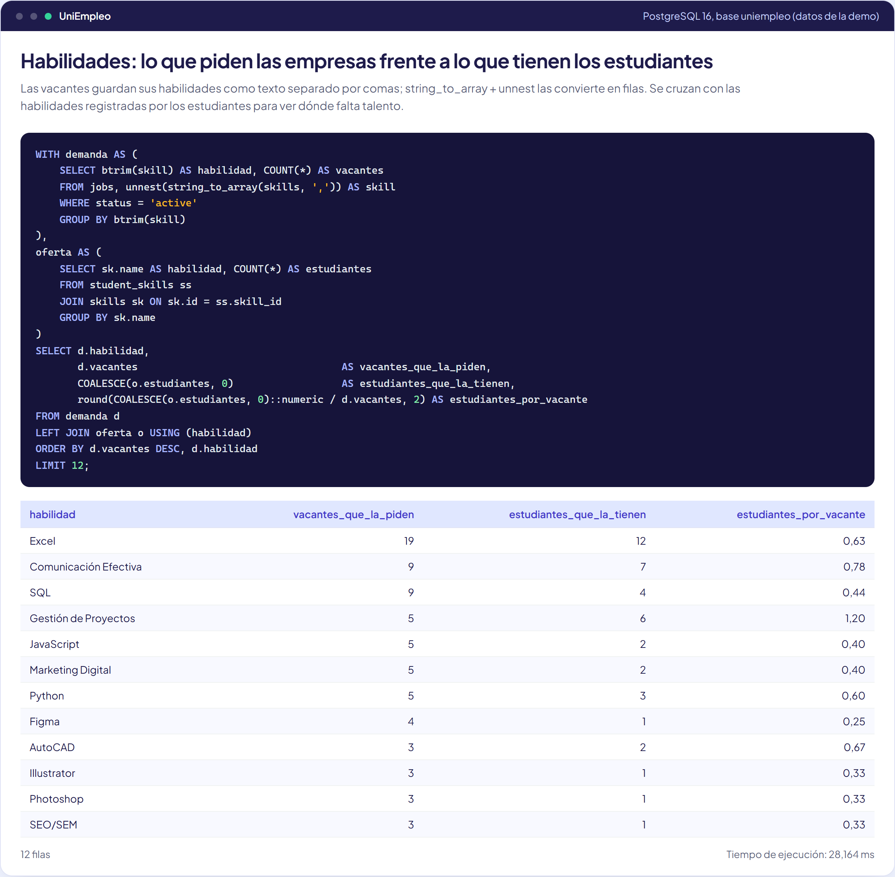

### 5. Vacantes afines a un estudiante
[`05-vacantes-afines-a-un-estudiante.sql`](database/queries/05-vacantes-afines-a-un-estudiante.sql): intersección de arreglos (`INTERSECT`) entre lo que pide la vacante y lo que sabe el estudiante.

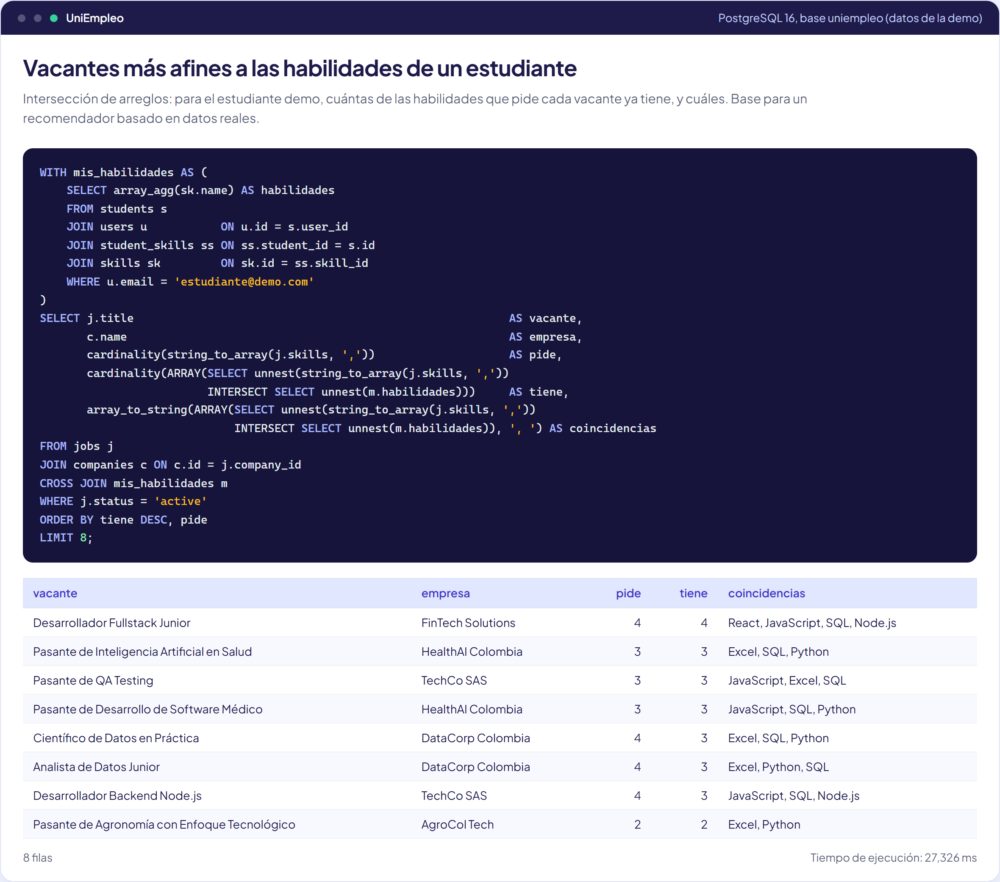

### 6. Cursos y finalización
[`06-cursos-y-finalizacion.sql`](database/queries/06-cursos-y-finalizacion.sql): `FILTER (WHERE completed)` sobre una columna booleana.

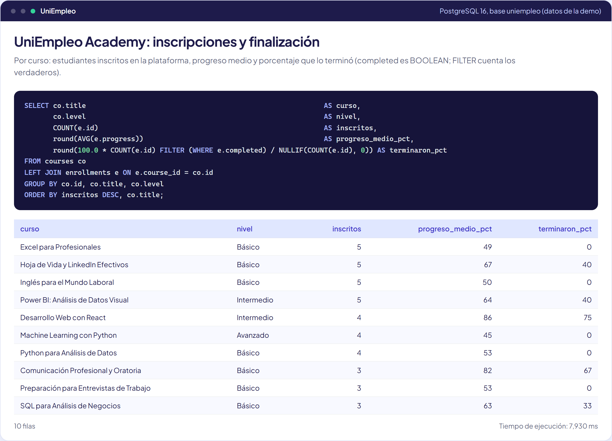

### 7. Estudiantes más activos
[`07-estudiantes-mas-activos.sql`](database/queries/07-estudiantes-mas-activos.sql): ranking con `DENSE_RANK()`.

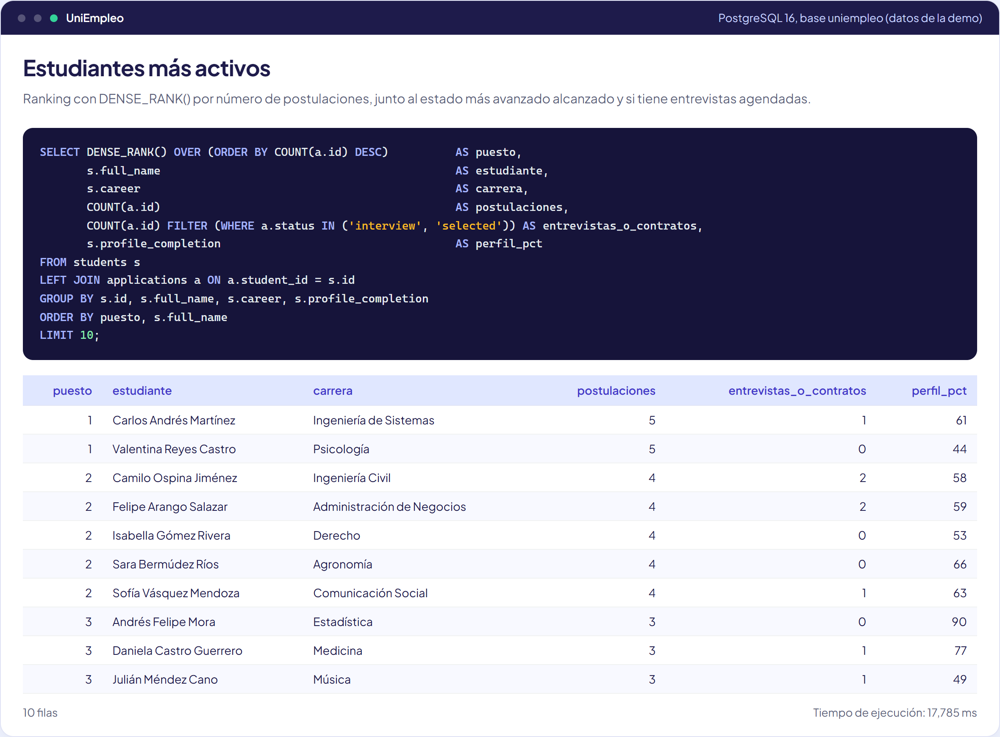

### 8. Restricción de salario
[`08-restriccion-salario.sql`](database/queries/08-restriccion-salario.sql): PostgreSQL rechaza un rango salarial invertido.

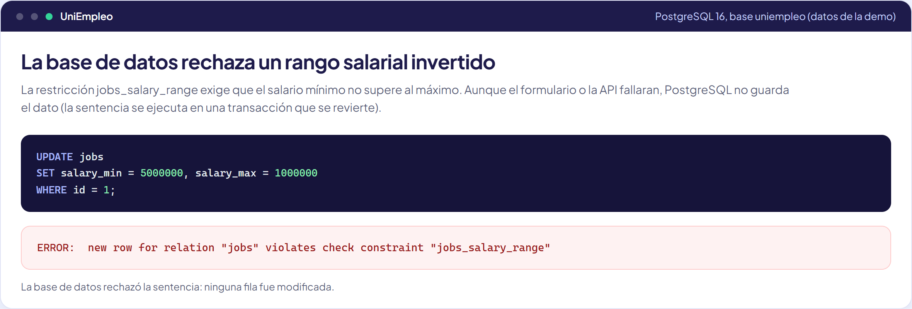

### 9. Plan de ejecución
[`09-plan-de-ejecucion.sql`](database/queries/09-plan-de-ejecucion.sql): el índice `(status, created_at DESC)` entrega las vacantes ya ordenadas.

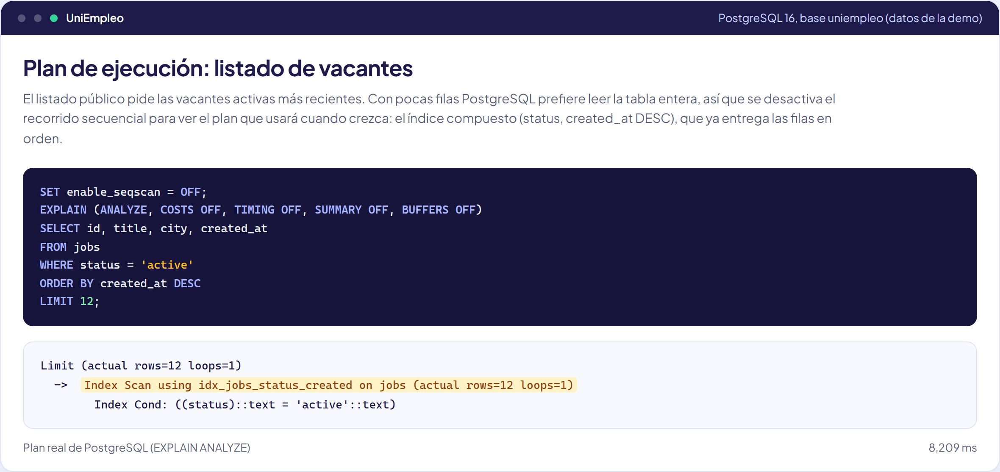

### 10. Tablas
[`10-tablas.sql`](database/queries/10-tablas.sql): filas y tamaño de cada tabla.

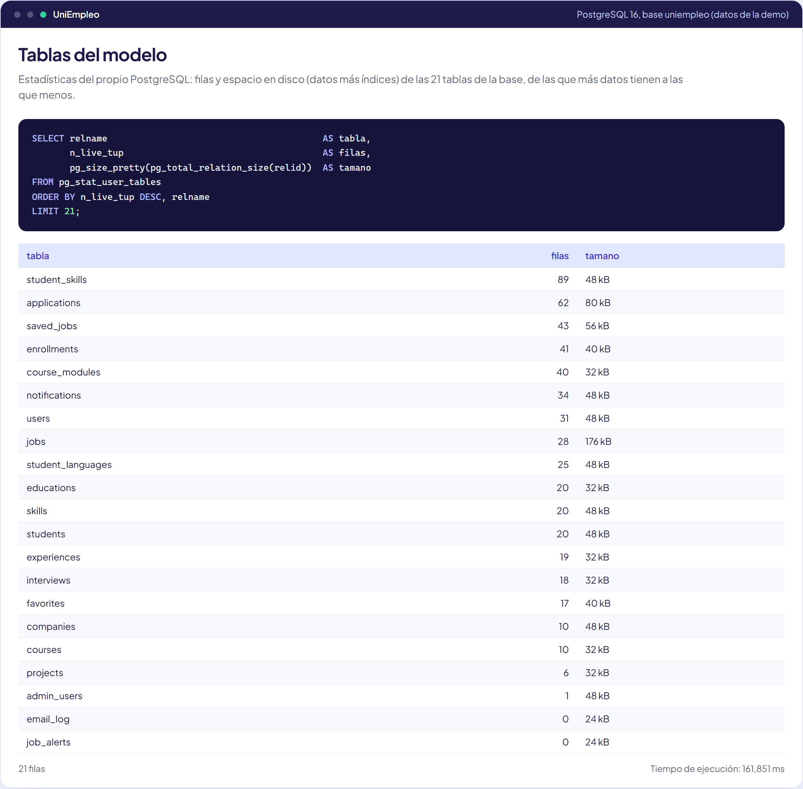

## Cómo reproducir las consultas

Con la base levantada (`docker compose up -d`) y los datos de la demo cargados (`npm run seed` en `backend/`):

```bash
docker compose exec -T postgres psql -U uniempleo -d uniempleo < docs/database/queries/04-oferta-y-demanda-de-habilidades.sql
```

O con un PostgreSQL local: `psql "$DATABASE_URL" -f docs/database/queries/04-oferta-y-demanda-de-habilidades.sql`. También se puede abrir con DBeaver, pgAdmin o TablePlus.
